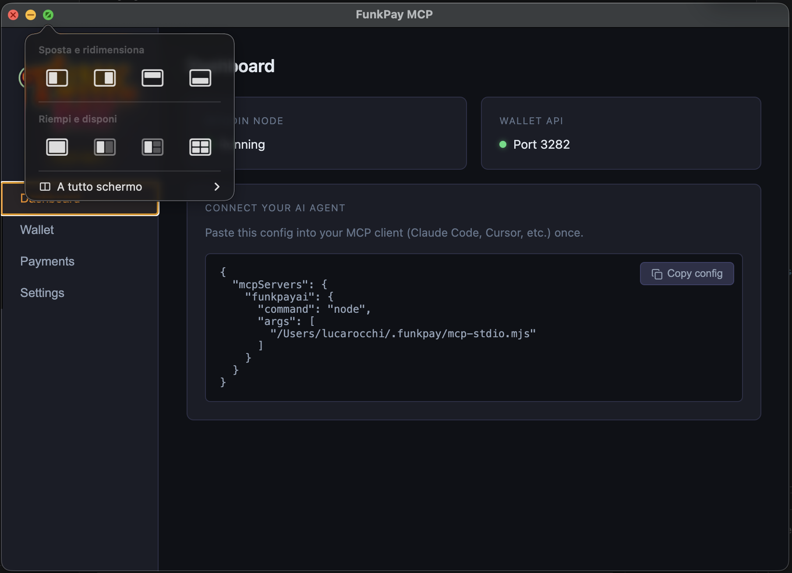
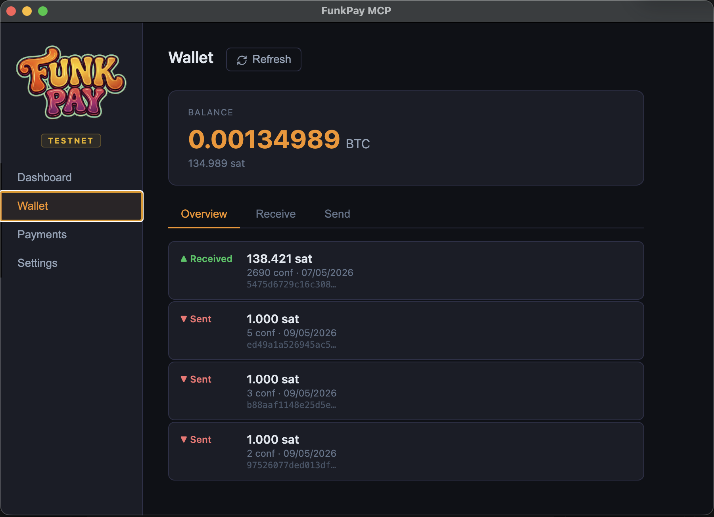
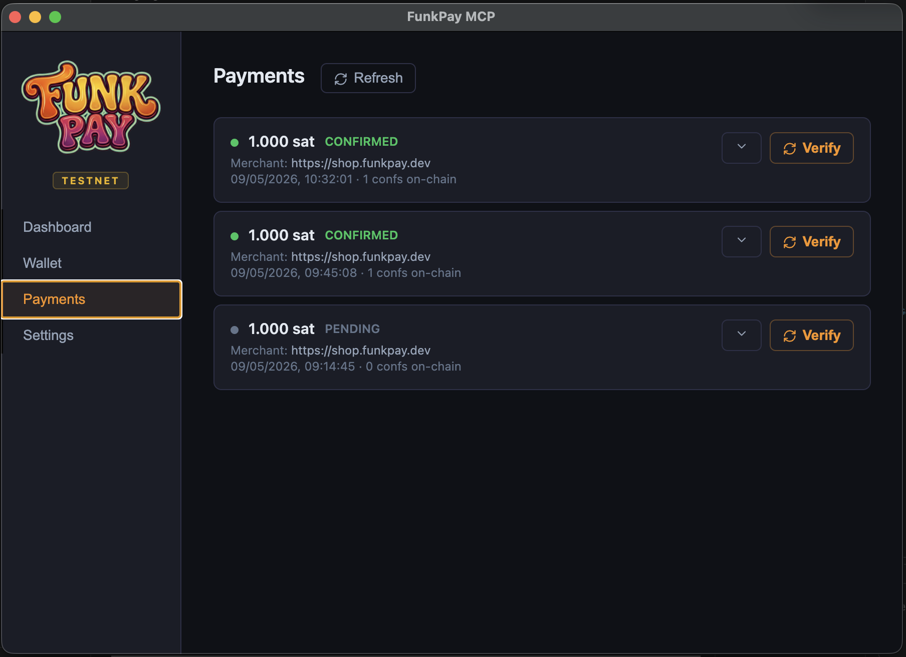
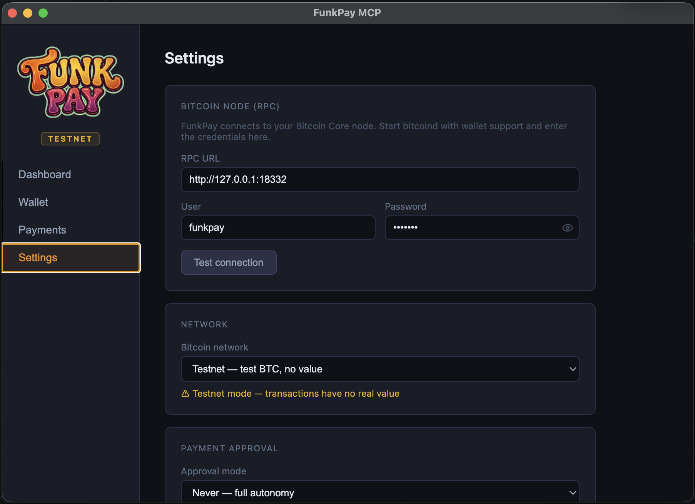

# FunkPay MCP

**Bitcoin wallet for AI agents.** A desktop app that connects to your Bitcoin Core node and exposes an MCP server — so any AI agent (Claude Code, Cursor, Windsurf, etc.) can send and receive Bitcoin autonomously, within the limits you configure.

Part of the [FunkPay](https://funkpay.dev) ecosystem.

---

## How it works

FunkPay MCP is an Electron desktop app. It:

1. Connects to your local **Bitcoin Core node** via RPC
2. Runs a local **REST API** on port 3282
3. Installs a lightweight **stdio MCP proxy** at `~/.funkpay/mcp-stdio.mjs`

Your AI agent talks to the proxy over stdio. The proxy forwards calls to the REST API. The API talks to Bitcoin Core. If the app is not running when the agent tries to call a tool, the proxy auto-launches it.

---

## Screenshots

<table>
  <tr>
    <td><br><sub>Dashboard — MCP config ready to copy</sub></td>
    <td><br><sub>Wallet — balance, send, receive</sub></td>
  </tr>
  <tr>
    <td><br><sub>Payments — agent payment history</sub></td>
    <td><br><sub>Settings — RPC, network, approval policy</sub></td>
  </tr>
</table>

---

## Requirements

- macOS (arm64 or x64) — Windows and Linux coming
- **Bitcoin Core** running locally with RPC enabled and wallet support
- Node.js (for the stdio proxy)
- ~500 MB disk space (app only — blockchain data is on your node)

---

## Setup

### 1. Install the app

Download and open `FunkPayMCP-*.dmg`, drag to Applications.

### 2. Start Bitcoin Core

FunkPay connects to an existing bitcoind node over RPC. Start it with wallet support:

```bash
bitcoind -server -rpcuser=<user> -rpcpassword=<pass> -wallet=funkpay
```

For testnet:
```bash
bitcoind -testnet -server -rpcuser=<user> -rpcpassword=<pass> -wallet=funkpay
```

### 3. Configure RPC credentials

Open **Settings** in the app and enter:
- **RPC URL** — e.g. `http://127.0.0.1:8332` (mainnet) or `http://127.0.0.1:18332` (testnet)
- **User** and **Password** — from your `bitcoin.conf`

Click **Test connection** to verify.

### 4. Add to your agent's MCP config

The Dashboard shows the exact config snippet to copy. It looks like this:

```json
{
  "mcpServers": {
    "funkpayai": {
      "command": "node",
      "args": ["~/.funkpay/mcp-stdio.mjs"]
    }
  }
}
```

For **Claude Code**: add to `~/.claude.json` or your project's `.claude/settings.json`.

The proxy is installed automatically at first launch and updated on every app restart.

---

## MCP Tools

| Tool | Description |
|------|-------------|
| `get_balance` | Wallet balance in satoshis |
| `get_new_address` | Generate a new Bitcoin receive address |
| `send_payment` | Send BTC to an address (subject to approval policy) |
| `get_transaction` | Transaction status and confirmations |
| `list_transactions` | Recent transaction history |
| `create_invoice` | Create a payment invoice on a FunkPay merchant server |
| `get_invoice_status` | Poll invoice status |
| `wait_for_payment` | Wait until an invoice is detected or confirmed |
| `list_merchants` | List trusted FunkPay merchants configured in Settings |
| `discover_merchant` | Auto-discover a FunkPay server from a domain name |

### Example agent prompt

```
You have access to a Bitcoin wallet via FunkPay MCP.
To buy something from a FunkPay merchant:
1. Use discover_merchant to find the server for the domain
2. Use create_invoice to create a payment request
3. Use send_payment to pay the invoice address
4. Use wait_for_payment to confirm the payment went through
```

---

## Payment Approval

Configure in **Settings → Payment Approval**:

| Mode | Behaviour |
|------|-----------|
| **Never** | Full autonomy — agent pays without prompting |
| **Threshold** | Asks for confirmation above X satoshis (default: 100,000 sat) |
| **Always ask** | Every payment requires your approval via a system dialog |

---

## Network

Supports **mainnet** (real BTC) and **testnet3** (test BTC, no value). Switch in **Settings → Network**. The app reconnects automatically; a warning banner is shown in testnet mode.

---

## FunkPay Ecosystem

| Project | Role |
|---------|------|
| **FunkPay MCP** (this) | Agent wallet — payer side |
| [btcfunkpay](https://github.com/lucarocchi/btcfunkpay) | Merchant payment server (Python/FastAPI) |
| [btcfunk](https://github.com/lucarocchi/btcfunk) | btcfunk.com — analytics and widget CDN |

Demo merchant (testnet): [shop.funkpay.dev](https://shop.funkpay.dev)

---

## Security

- The REST API listens on `127.0.0.1` only — not exposed to the network
- All calls from the MCP proxy are authenticated with a shared secret token written to `~/.funkpay/api-token` at first launch
- `send_payment` is protected by the approval policy you configure
- A payment mutex prevents concurrent payments from the agent and the UI

---

## Building from source

```bash
npm install
npm run dev        # dev mode with hot reload
npm run build      # production build
npm run package    # generate DMG / installer
```
